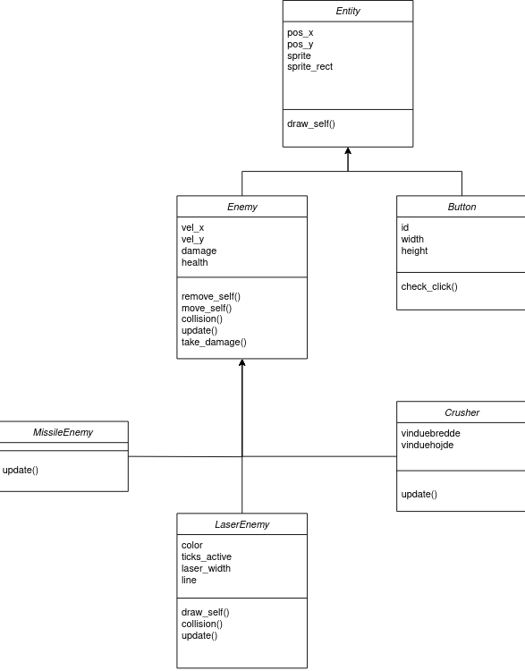
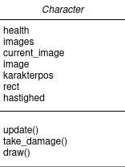
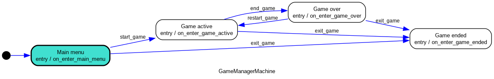
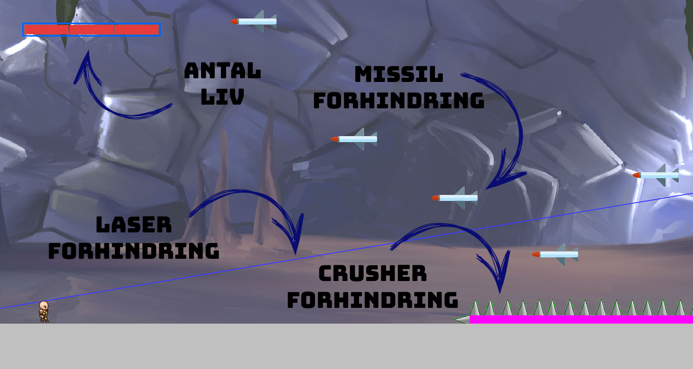
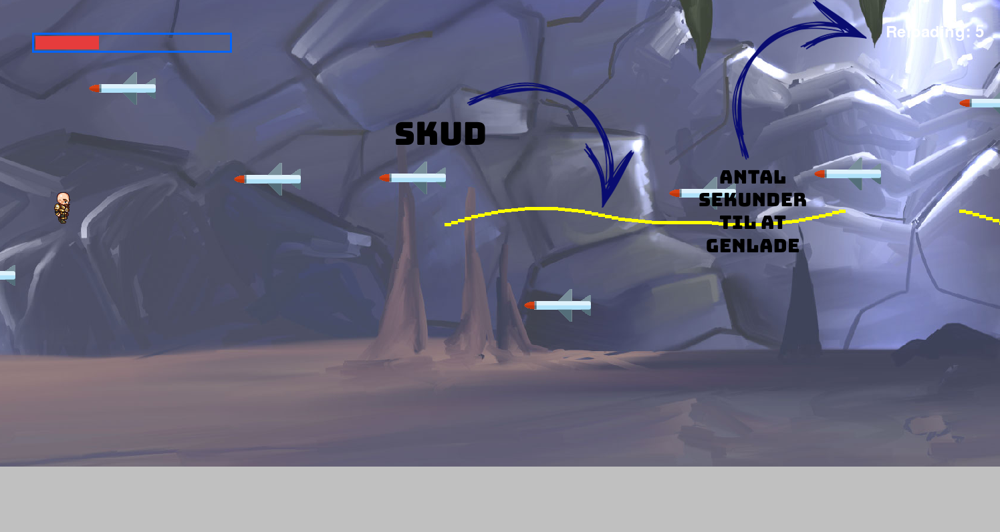

# Om spillet:

Vi har lavet et endless runner spil i samme genre som Jetpack Joyride eller Dino Game. 

Formålet i spillet er at nå så langt som muligt uden at dø til de forskellige forhindringer der instantieres.
Spillet er designet efter en oop-model hvor childclasses arver forskellige egenskaber, hvilket mindsker kodegentagelse.

I toppen har vi Entity-Class der kan tegne sig selv i en position.   
2 child-classes (enemy og Button) arver fra Entity og tilføjer deres egne relevante funktioner, såsom at tjekke et click eller collision med character.
Enemy har igen 3 childclasses, der instantieres.

## Class-diagram Entities:

## Class-diagram Character:

Derudover bruges et Statemachine pattern til at styre hvilken state (hovedmenu, spil, gameover etc.) som brugeren befinder sig i.

## State-diagram:

## Sådan spiller du:

For at styre figuren kan man enten bruge "w" eller pil op tasten. Når spillet starter gælder det om at komme igennem de forskellige forhindringer uden at dø. På et tidspunkt i spillet vil et våben komme frem, når du har samlet våbnet op kan det bruges til at skyde raketerne ned. For at bruge våbnet trykker man på mellemrum. Våbnet har et magasin på 100 skud, når de 100 skud er brugt, skal du vente i fem sekunder for at få skuddene igen. Se hvor langt du kan nå!

